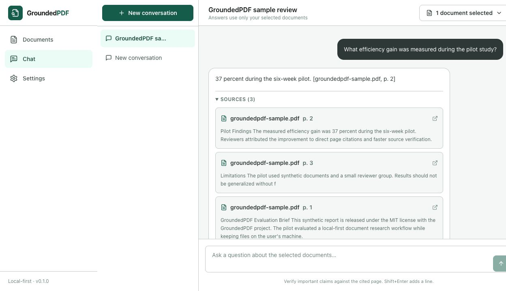
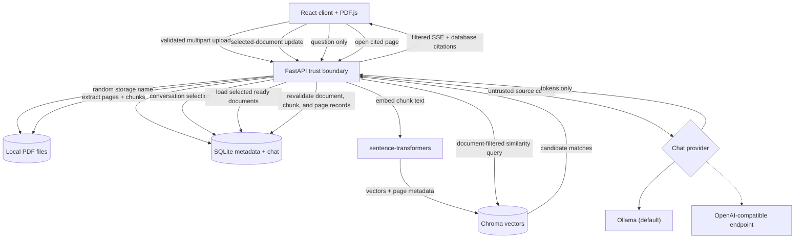

# GroundedPDF

[](https://github.com/ewilmoth23/grounded-pdf/actions/workflows/ci.yml)
[](LICENSE)
[](https://www.python.org/)
[](https://nodejs.org/)
[](https://ollama.com/)

**Ask questions of your PDFs locally—and verify every supported answer on the cited page.**

GroundedPDF is a local-first document research application. It extracts PDFs page by page, indexes
them on your machine, restricts retrieval to documents you select, streams an answer from a local or
OpenAI-compatible model, and attaches application-verified page citations. It is useful when a plain
chat response is not enough and you need a direct path back to the source.

> GroundedPDF is a local, single-user application. It has no authentication and must not be exposed
> directly to the public internet.



_Real capture from the Docker application using the repository's generated synthetic PDF. No private
document content or fabricated interface is shown._

## Why GroundedPDF

- **Local by default:** PDFs, metadata, chat history, embeddings, and vector data stay in local
  storage. A hosted document service is not required.
- **Document-scoped retrieval:** each conversation searches only the processed documents selected by
  the user.
- **Verifiable answers:** citation objects are constructed from retrieved database records, not
  accepted from the language model or browser.
- **Honest uncertainty:** when retrieval cannot support an answer, the application returns a fixed
  insufficient-evidence response instead of asking the model to guess.
- **Inspectable implementation:** upload validation, extraction, chunking, embeddings, retrieval,
  streaming, citation filtering, and deletion are explicit application boundaries.

## Capabilities

- Secure single- and multi-PDF upload with structural, MIME, signature, file-count, and size checks
- Page-by-page PyMuPDF extraction with searchable/scanned-page detection
- Configurable overlapping chunks and local sentence-transformer embeddings
- Persistent SQLite metadata and a document-filtered Chroma vector index
- Ollama by default, with an optional OpenAI-compatible chat-completions endpoint
- Server-sent-event streaming with provider and interrupted-stream failure handling
- Application-owned inline citations and source cards that open the original PDF page with the
  cited passage highlighted when text geometry allows
- Claim-level answer verification: each sentence of a saved answer is checked against your
  documents and labeled supported, weak, or not found, with links to the matched evidence
- Conversation history, document selection, retryable processing, and complete deletion
- Responsive React interface, safe Markdown rendering, dark mode, and a PDF.js page viewer
- Deterministic test provider and synthetic PDF; automated tests do not require model access

## Five-minute demo

1. Run `make sample` to generate `sample_documents/groundedpdf-sample.pdf`.
2. Open **Documents**, upload the sample, and wait for the `ready` status.
3. Open **Chat**, create a conversation, and select **GroundedPDF Evaluation Brief**.
4. Ask: `What efficiency gain was measured during the pilot study?`
5. Confirm the answer states `37 percent`, then open the page-2 source card and verify the original
   text in the PDF viewer.
6. Ask an unsupported question such as `On what date was the lunar colony founded?` and confirm the
   application returns its insufficient-evidence response with no citations.

## Architecture

The browser is a presentation client, not a source of trusted citation metadata. FastAPI owns file
validation, retrieval scope, relational revalidation, prompting, model-output filtering, and
citation persistence.



See [architecture](docs/architecture.md), [data flow](docs/data-flow.md), and
[security assumptions](docs/security.md) for the detailed boundaries and invariants.

## Quick start with Docker

Prerequisites: Docker Desktop and [Ollama](https://ollama.com/) for real answers. Ollama is not
bundled in Compose.

```bash
git clone https://github.com/ewilmoth23/grounded-pdf.git
cd grounded-pdf
cp .env.example .env
ollama pull llama3.2:3b
make docker-up
```

Open <http://localhost:8080>. The named `groundedpdf_data` volume persists SQLite, uploaded PDFs,
Chroma, and the embedding-model cache. Published ports bind to `127.0.0.1`. The API and web
containers run as non-root users with read-only root filesystems, dropped capabilities, bounded
temporary storage, and health checks.

The first build downloads CPU-only PyTorch. The first document-processing run downloads the configured
embedding model. If Ollama is unavailable, the application still starts and reports degraded provider
health.

Useful Docker commands:

```bash
make docker-verify  # rebuild, start, wait for health, and run production smoke checks
make docker-logs    # follow API and web logs
make docker-down    # stop containers without deleting the persistent data volume
```

For an Ollama server on another host:

```bash
GROUNDEDPDF_DOCKER_OLLAMA_BASE_URL=http://192.168.1.10:11434 make docker-up
```

## Native development setup

Prerequisites: Python **3.12+**, Node.js **22+**, npm, and Ollama for real answers.

```bash
git clone https://github.com/ewilmoth23/grounded-pdf.git
cd grounded-pdf
cp .env.example .env
make install
make migrate
make sample
make doctor
```

If `python3` on your PATH is older than 3.12, point the Makefile at a newer interpreter:
`make install PYTHON=python3.12`.

Start the services in separate terminals:

```bash
make dev-api
make dev-web
```

Open <http://localhost:5173>. API documentation is available at <http://localhost:8000/docs>.

### Optional OCR

Install Tesseract for your operating system, then add the optional Python dependencies:

```bash
.venv/bin/pip install -e "./apps/api[ocr]"
```

Set `GROUNDEDPDF_ENABLE_OCR=true` and restart the API. OCR is disabled by default and is not included
in the standard Docker image.

## Verified quality commands

These commands are exercised by the release audit and/or the CI workflow:

| Purpose                                      | Command                      |
| -------------------------------------------- | ---------------------------- |
| Environment check                            | `make doctor`                |
| Apply migrations                             | `make migrate`               |
| Backend and frontend tests                   | `make test`                  |
| Ruff, formatting, mypy, ESLint, and Prettier | `make lint`                  |
| Strict TypeScript and Vite production build  | `make build`                 |
| Chromium end-to-end flow                     | `cd apps/web && npm run e2e` |
| Production Compose build and smoke checks    | `make docker-verify`         |

The E2E flow covers upload, page extraction, document-scoped retrieval, streaming, citations,
insufficient evidence, and opening the cited page. Exact results are recorded in the
[production readiness self-audit](docs/audit-report.md).

## Configuration

Server settings use the `GROUNDEDPDF_` prefix. Theme preference is browser-local. Provider, model,
chunking, and retrieval-count changes made in the UI are stored in SQLite.

| Variable                                          | Default                                  | Purpose                                                  |
| ------------------------------------------------- | ---------------------------------------- | -------------------------------------------------------- |
| `GROUNDEDPDF_ENVIRONMENT`                         | `development`                            | Deployment environment label used in logs and health     |
| `GROUNDEDPDF_DATA_DIR`                            | `./data`                                 | Local root for uploads, Chroma, and the default database |
| `GROUNDEDPDF_DATABASE_URL`                        | `sqlite:///./data/groundedpdf.db`        | SQLAlchemy database URL                                  |
| `GROUNDEDPDF_CORS_ORIGINS`                        | local Vite/web origins                   | JSON array of allowed browser origins                    |
| `GROUNDEDPDF_MAX_UPLOAD_MB`                       | `50`                                     | Maximum size of each PDF                                 |
| `GROUNDEDPDF_MAX_UPLOAD_BATCH_MB`                 | `200`                                    | Maximum combined raw file bytes per request              |
| `GROUNDEDPDF_MAX_UPLOAD_FILES`                    | `20`                                     | Maximum files per upload request                         |
| `GROUNDEDPDF_RATE_LIMIT_PER_MINUTE`               | `60`                                     | Per-client API request limit                             |
| `GROUNDEDPDF_UPLOAD_TMPFS_MB`                     | `256`                                    | Docker API temporary-filesystem size                     |
| `GROUNDEDPDF_EMBEDDING_MODEL`                     | `sentence-transformers/all-MiniLM-L6-v2` | Local embedding model                                    |
| `GROUNDEDPDF_CHUNK_SIZE`                          | `900`                                    | Target characters per chunk                              |
| `GROUNDEDPDF_CHUNK_OVERLAP`                       | `150`                                    | Characters shared by adjacent chunks                     |
| `GROUNDEDPDF_RETRIEVAL_COUNT`                     | `6`                                      | Maximum retrieved context chunks                         |
| `GROUNDEDPDF_RETRIEVAL_MIN_SCORE`                 | `0.15`                                   | Minimum cosine similarity                                |
| `GROUNDEDPDF_RETRIEVAL_SEMANTIC_CONFIDENCE_SCORE` | `0.45`                                   | Similarity that can admit evidence without term overlap  |
| `GROUNDEDPDF_VERIFICATION_SUPPORTED_SCORE`        | `0.6`                                    | Combined score at which a verified claim is "supported"  |
| `GROUNDEDPDF_VERIFICATION_WEAK_SCORE`             | `0.35`                                   | Combined score at which a verified claim is a weak match |
| `GROUNDEDPDF_MODEL_PROVIDER`                      | `ollama`                                 | `ollama` or `openai_compatible`; `mock` is test-only     |
| `GROUNDEDPDF_MODEL_NAME`                          | `llama3.2:3b`                            | Provider model identifier                                |
| `GROUNDEDPDF_OLLAMA_BASE_URL`                     | `http://localhost:11434`                 | Native Ollama endpoint                                   |
| `GROUNDEDPDF_DOCKER_OLLAMA_BASE_URL`              | `http://host.docker.internal:11434`      | Container-to-host Ollama endpoint                        |
| `GROUNDEDPDF_OPENAI_BASE_URL`                     | `http://localhost:8001/v1`               | Native compatible API root                               |
| `GROUNDEDPDF_DOCKER_OPENAI_BASE_URL`              | `http://host.docker.internal:8001/v1`    | Container-to-host compatible API root                    |
| `GROUNDEDPDF_OPENAI_API_KEY`                      | empty                                    | Optional bearer token; never returned to the browser     |
| `GROUNDEDPDF_TEMPERATURE`                         | `0.1`                                    | Generation temperature                                   |
| `GROUNDEDPDF_MAX_OUTPUT_TOKENS`                   | `800`                                    | Provider output limit                                    |
| `GROUNDEDPDF_MODEL_TIMEOUT_SECONDS`               | `120`                                    | Provider request timeout in seconds                      |
| `GROUNDEDPDF_ENABLE_OCR`                          | `false`                                  | Use installed Tesseract on scanned pages                 |
| `VITE_API_BASE_URL`                               | `http://localhost:8000/api/v1`           | Browser-facing API root used by the Vite dev client      |

Chunking and embedding changes do not silently rebuild existing vectors. Reprocess affected documents
after changing those settings. If the Docker batch limit is increased, also increase
`GROUNDEDPDF_UPLOAD_TMPFS_MB` enough to hold multipart temporary files.

## Repository structure

```text
apps/api/          FastAPI service, migrations, providers, RAG pipeline, and pytest suite
apps/web/          React client, unit tests, Playwright flow, and Nginx image
docs/              Architecture, data flow, security, development, and audit documentation
scripts/           Environment doctor, E2E preparation, sample generation, and guarded reset
sample_documents/  Synthetic sample specification and generated local PDF target
.github/           CI, Dependabot, issue forms, and pull-request template
```

## Limitations

- GroundedPDF is single-user software with no accounts, authentication, authorization, or tenant
  isolation. Loopback binding is a safety boundary, not an access-control system.
- SQLite, Chroma, and in-process background work target one local instance; distributed workers and
  concurrent multi-user workloads are outside the current design.
- Image-only pages require separately installed Tesseract and OCR dependencies. The standard Docker
  image does not include them.
- Exact-passage highlighting depends on the PDF text layer agreeing with the extracted text. When
  they diverge (typically scanned or OCR pages), the viewer falls back to the page-level citation
  and says so.
- Changing the embedding model or chunk geometry requires manual document reprocessing.
- Local-first does not mean network-free: initial model downloads require network access, and a
  configured remote OpenAI-compatible provider receives retrieved source context.
- Retrieval and citation ownership reduce hallucination risk but do not guarantee ideal wording or
  interpretation. Important claims should still be checked against the cited page.

## Focused roadmap

1. Add configuration fingerprints and safe bulk re-indexing after embedding/chunk changes.
2. Add OCR language selection, preprocessing controls, and Docker OCR documentation.
3. Export conversations with stable page links and source metadata.

Accounts, cloud sync, web search, autonomous agents, billing, and Kubernetes are intentionally outside
the first release.

## Contributing, security, and license

Read [CONTRIBUTING.md](CONTRIBUTING.md), the [Code of Conduct](CODE_OF_CONDUCT.md), the
[security policy](SECURITY.md), and [RELEASE_CHECKLIST.md](RELEASE_CHECKLIST.md) before contributing
or publishing a release. GroundedPDF is available under the [MIT License](LICENSE).
