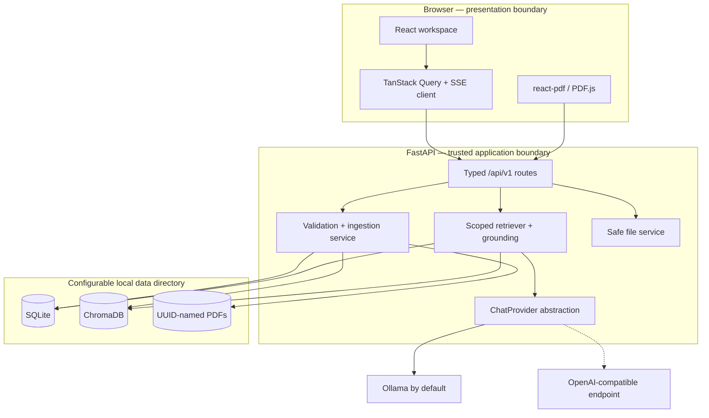

# Architecture

## Goals and constraints

GroundedPDF maximizes verifiability and local privacy for a single local user. The architecture keeps
the trusted boundary small: the API validates files, determines retrieval scope, constructs model
context, and owns citation metadata. The browser never supplies a storage path, vector filter, page
number for an answer, or provider secret.

## Component responsibilities

### API routes

Routes validate typed requests, resolve database entities, translate domain failures into consistent
errors, and stream Server-Sent Events. They do not parse PDFs or construct vector queries directly.

### Relational database

SQLite stores documents, pages, chunks, processing attempts, conversations, selected-document links,
messages, citations, and permitted runtime settings. Foreign keys and delete cascades make the
relational cleanup boundary explicit. Alembic is the schema authority.

### File storage

Original names are display metadata only. Each accepted PDF receives a UUID storage name beneath the
configured upload directory. All serving and deletion paths are resolved and checked against that
directory. Database rows never store arbitrary absolute paths.

### Ingestion

PyMuPDF validates structure and extracts in physical page order. Normalization reduces accidental
whitespace without merging paragraphs. Each page is recorded even when it has too little text to
search. Chunks never cross a page boundary, so every vector has one stable page citation.
Chunk offsets and raw text refer to the stored raw page text; each chunk is normalized separately for
embedding and retrieval.
When explicitly enabled, low-text pages are rendered locally and passed through the optional
Tesseract adapter; missing OCR dependencies fail processing with a safe, actionable error.

An ingestion retry first removes the document's prior vector records and child rows, then performs a
deterministic upsert using IDs of the form `document:page:chunk`. A document becomes `ready` only after
the embedding batch and vector upsert succeed. A failure is recorded with a safe user-facing message.

Ingestion also records two pieces of per-document metadata with different trust roles. The PDF
bookmark tree is captured as a bounded outline (truncated titles, page targets clamped to the
document) and stored as JSON; it is presentation metadata only — the viewer uses it for section
navigation, and it never participates in retrieval or citations. The index fingerprint — the
embedding model plus chunk size and overlap in effect when the index was built — guards retrieval
consistency: query vectors are only comparable to stored vectors produced under the same settings.
When the effective runtime settings diverge from a ready document's fingerprint (or the fingerprint
predates this mechanism), the API reports the index as stale, and a bulk reprocess endpoint
re-queues those documents through the same atomic status claim as a manual retry, so stale vectors
are fully replaced rather than mixed with new ones.

### Vector storage and embeddings

Chroma is embedded in the API process and persisted locally. `sentence-transformers` loads lazily so
startup and metadata operations do not require a model download. Tests use hashing embeddings and an
in-memory vector store, both behind the same protocols.

### Retrieval and grounding

The retriever receives document IDs from the conversation relationship, not the browser's question
request. It applies those IDs as a Chroma filter, over-fetches, rejects low scores, and requires
meaningful term overlap for candidates below the high-confidence semantic threshold. It then removes
near-duplicates and round-robins results across documents. The grounding layer creates source markers
and structured citation objects before generation begins. Every vector result is first resolved back
to its selected relational chunk and document; stale or mismatched vector metadata is discarded, and
the prompt, page number, document name, and citation excerpt are rebuilt from those database rows.

The model receives only the system policy, source blocks, their application-supplied markers,
and the question. Generated HTML is never rendered. If retrieval finds no acceptable evidence, the
provider is skipped and the API returns a deterministic insufficient-evidence response.
Citation-shaped text is filtered during streaming as well as before persistence, so an invented marker
cannot appear transiently as if it were an application-owned source.

### Answer verification

Verification is a read-only lens over persisted answers. On request, the API splits a saved
assistant message into sentences with a deterministic rule-based splitter (no model call), embeds
each sentence locally, and scores it against the conversation's selected and cited documents by
blending cosine similarity with the retrieval term-overlap heuristic. Fixed thresholds in
configuration map each score to a supported, weak, or unsupported verdict, and every reported
source is rebuilt from relational chunk records before it reaches the client. The answer itself is
never modified; results are cached in-process per message because messages are immutable, and the
fixed insufficient-evidence response verifies to an empty result.

### Semantic quote search

Quote search is a deterministic, retrieval-only path that reuses the retrieval trust boundary
without a model. `GET /search` embeds the query locally, filters the vector store to ready
documents (optionally narrowed to a caller-selected subset of them), applies only the low
retrieval score floor for recall, and rebuilds every candidate from relational chunk and document
records before returning document, page, excerpt, and score. No chat provider is involved and
nothing is generated: the response contains only text stored during ingestion, which is why the
search view can promise exact passages from the user's documents.

### Compare mode

Compare is a per-question mode, not a conversation setting. When a question arrives with
`mode: "compare"`, the API requires between two and four ready selected documents and then runs the
normal retrieval and grounding pipeline once per document, scoped to that document alone. Each
document's section streams through its own citation filter that admits only that document's
markers, so one document's evidence can never appear under another's heading. A document with no
admissible evidence gets the fixed insufficient-evidence response in its section and its share of
the question never reaches the provider. The persisted assistant message is ordinary Markdown — one
`## document name` heading per section — with the union of per-document citations, and a nullable
`mode` column on messages records how it was produced so the client can render sections side by
side. The SSE protocol is unchanged: metadata, tokens, done.

### Provider abstraction

`ChatProvider` exposes two operations: token streaming and a health check. Ollama and generic OpenAI-
compatible providers implement transport details independently from retrieval. Adding a provider does
not change prompts, citations, persistence, routes, or the web client.

### Background execution

Version 1 uses FastAPI background tasks with a fresh SQLAlchemy session per job. This keeps installation
small and is appropriate for a single local user. Processing state is durable, so refreshes are safe;
process termination can leave a job in `processing`, which a later retry can re-run idempotently.
At the next API startup, abandoned `queued` or `processing` records are marked failed with a safe retry
message. Active documents cannot be deleted, avoiding ingestion/deletion races across file, vector, and
relational storage.

Deletion first commits a durable `deleted` tombstone, then removes vectors and the stored file before
deleting the relational row. If external cleanup or the final database commit fails, the tombstone
remains visible and the operation can be retried safely.

## Dependency boundaries

- `core` and `db` do not depend on API routes.
- `services` own external file, PDF, embedding, and vector operations.
- `providers` know model protocols but not conversations or citations.
- `rag` composes retrieval and providers; it does not accept browser-authored source metadata.
- `api` coordinates services and schemas.
- `web` consumes only versioned API types and safe file URLs.

This modular monolith is simpler to install, debug, back up, and secure than microservices for the
version 1 workload.
