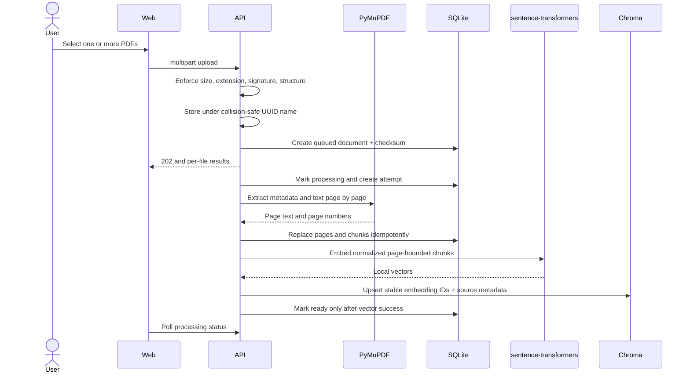
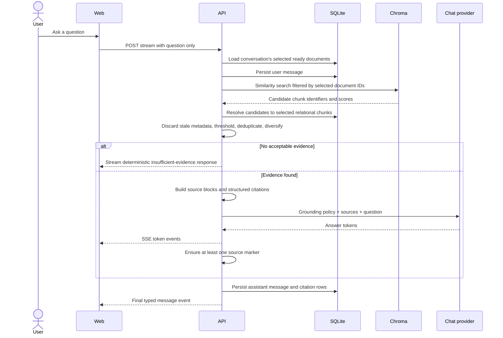
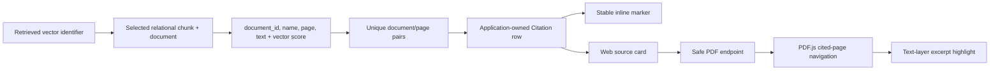
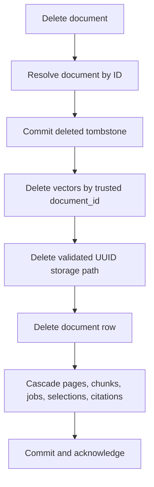

# Data flow

## Upload to ingestion

Unsupported files are rejected before a database record is created. Duplicate checksums reuse the
existing record and discard the temporary upload; if that record's trusted stored file is missing, the
new upload restores it and requeues ingestion. Pages below the searchable character threshold are
stored with `is_searchable=false`; when optional OCR is enabled, those pages are rendered locally and
sent to Tesseract before being classified as unsearchable.

## Question to answer

## Citation construction

The model can repeat a supplied marker, but it cannot create the citation object's document ID, file
URL, page target, excerpt, score, or ordinal. Those values come from the retrieval record.

When a source card opens the viewer, the citation's excerpt travels with the navigation (router
state, with a truncated `highlight` search parameter as a fallback). The viewer normalizes the
excerpt and the PDF.js text-layer strings (case, whitespace, ligatures, end-of-line hyphenation),
locates the excerpt — exact match first, then the longest shared run when extraction and the text
layer disagree — and wraps the matched characters in highlight marks before scrolling the first one
into view. This is presentation only: the browser never supplies citation data, and when no reliable
match exists (typically scanned or OCR pages) the viewer keeps the page-level indicator and shows
"Evidence is on this page; exact position unavailable."

## Deletion

The durable tombstone is committed before external cleanup. If vector, file, or final relational
cleanup fails, the API keeps the tombstone with a retry message instead of claiming complete deletion.
Deletion is rejected while ingestion is queued or processing so a worker cannot recreate vectors
after cleanup.
